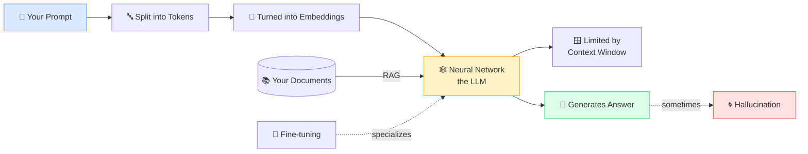

# 🧠 AI for Beginners — Visual Edition

### Understand AI in minutes, not months.

**Simple visuals + everyday analogies that explain AI concepts to *everyone* — whether you write code or have never opened a terminal.**

*If this helps you finally "get" AI — drop a ⭐. It helps more people find it.*

---

## 🤔 Why this exists

AI is everywhere, but most explanations are either **too technical** (walls of math) or **too fluffy** (no real understanding). 

This repo sits in the middle. Every concept gets:

- 🧒 **An "Explain Like I'm 5" analogy** — the one-liner you'll actually remember
- 🖼️ **A simple diagram** — see the idea, don't just read it
- 🔧 **"How it actually works"** — for when you're ready to go deeper
- 🌍 **A real-world example** — where you've already seen it in action

No PhD required. No prior coding needed. Just curiosity.

---

## 📚 The Concepts

### 🌱 Start here — the foundations

| # | Concept | One-liner |
|---|---------|-----------|
| 1 | [🗣️ LLM (Large Language Model)](concepts/llm.md) | A super-reader that learned to finish your sentences. |
| 2 | [🔤 Token](concepts/token.md) | The little chunks AI reads instead of whole words. |
| 3 | [📍 Embedding](concepts/embedding.md) | Turning meaning into coordinates on a map. |
| 4 | [🕸️ Neural Network](concepts/neural-network.md) | A guessing machine that learns from its mistakes. |
| 5 | [🏋️ Training vs Inference](concepts/training-vs-inference.md) | Studying for the exam vs taking the exam. |
| 6 | [💬 Prompt](concepts/prompt.md) | The instructions you give the AI. |
| 7 | [🪟 Context Window](concepts/context-window.md) | How much the AI can "keep in mind" at once. |
| 8 | [🎯 Fine-tuning](concepts/fine-tuning.md) | Teaching a generalist to become a specialist. |
| 9 | [📖 RAG (Retrieval-Augmented Generation)](concepts/rag.md) | Letting AI "look things up" before answering. |
| 10 | [🌀 Hallucination](concepts/hallucination.md) | When AI confidently makes stuff up. |

### ⚙️ How it actually thinks — under the hood

| # | Concept | One-liner |
|---|---------|-----------|
| 11 | [⚙️ Transformer](concepts/transformer.md) | The engine that reads every word at once. |
| 12 | [👀 Attention](concepts/attention.md) | Highlighting the words that matter most. |
| 13 | [🌡️ Temperature](concepts/temperature.md) | The creativity dial — safe vs wild. |
| 14 | [🔗 Chain of Thought](concepts/chain-of-thought.md) | Making the AI "show its work." |

### 🏗️ How it's built & trained

| # | Concept | One-liner |
|---|---------|-----------|
| 15 | [👍 RLHF](concepts/rlhf.md) | Teaching AI manners with human thumbs up/down. |
| 16 | [⚡ GPU](concepts/gpu.md) | The "many hands" chip that does millions of sums at once. |
| 17 | [📏 Overfitting](concepts/overfitting.md) | Memorizing the answers instead of understanding. |
| 18 | [🎛️ Parameters / Weights](concepts/parameters-weights.md) | The billions of tiny knobs that store what AI knows. |
| 19 | [🏛️ Foundation Model](concepts/foundation-model.md) | One giant base brain everything is built on. |
| 20 | [🗜️ Quantization](concepts/quantization.md) | Shrinking a model to run on your laptop. |

### 🛠️ Using AI — tools & applications

| # | Concept | One-liner |
|---|---------|-----------|
| 21 | [🤖 AI Agent](concepts/ai-agent.md) | An AI that *does* things, not just chats. |
| 22 | [🗄️ Vector Database](concepts/vector-database.md) | A library that files things by meaning. |
| 23 | [🎨 Diffusion Model](concepts/diffusion-model.md) | Sculpting images out of pure noise. |
| 24 | [🎭 GAN](concepts/gan.md) | A forger vs a detective, until the fakes look real. |
| 25 | [🪪 System Prompt](concepts/system-prompt.md) | The AI's hidden, always-on job description. |
| 26 | [🌈 Multimodal](concepts/multimodal.md) | An AI that can see, hear, and read. |
| 27 | [🛠️ Tool Calling](concepts/tool-calling.md) | How AI reaches out and uses real tools. |

### ⚖️ Trust & limits — the fine print

| # | Concept | One-liner |
|---|---------|-----------|
| 28 | [⚖️ Bias](concepts/bias.md) | AI inherits the unfairness in its data. |
| 29 | [📅 Knowledge Cutoff](concepts/knowledge-cutoff.md) | Why AI doesn't know recent news. |
| 30 | [🕵️ Prompt Injection](concepts/prompt-injection.md) | Hiding sneaky instructions to trick an AI. |
| 31 | [🧭 Alignment & Guardrails](concepts/alignment.md) | Teaching AI what *not* to do. |
| 32 | [🌅 AGI](concepts/agi.md) | The hypothetical "human-level at everything" AI. |

---

## 🗺️ How it all fits together

> **Read it in order** if you're brand new — each concept builds on the last.
> **Jump around** if you already know the basics.

---

## 🚀 Quick Start

1. Pick a concept from the [table above](#-the-concepts).
2. Read the analogy. Look at the diagram.
3. Curious? Read "How it actually works."
4. Found it useful? **Star the repo** ⭐ and share it.

---

## 🤝 Contributing

Know a concept we're missing? Have a better analogy? **We'd love your help.**

See [CONTRIBUTING.md](CONTRIBUTING.md) for the simple template — adding a concept takes about 10 minutes.

Good first additions: *Reinforcement Learning, Mixture of Experts (MoE), MCP, Deepfake, Backpropagation, Loss Function, Zero-shot vs Few-shot, Speech-to-Text / Text-to-Speech, Open vs Closed Models, AI Ethics.*

---

## 📜 License

[MIT](LICENSE) — free to use, share, remix, and teach with. Attribution appreciated.

---

**Made for curious humans.** 🧠

If this made AI click for you, the best thank-you is a ⭐.

