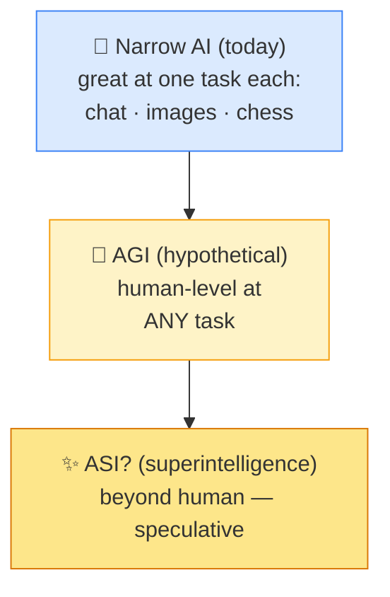

# 🌅 AGI (Artificial General Intelligence)

> **🧒 Explain Like I'm 5:** Today's AIs are each good at *one* thing. AGI would be a single AI that's as smart as a person at *everything* — and it doesn't exist yet.

## 🖼️ The Picture

## 🔧 How it actually works

Today's systems are **narrow AI**: extremely capable within a domain but unable to step outside it. A chess engine can't write a poem; an [LLM](llm.md) can't natively drive a car. **AGI** refers to a hypothetical AI with *general* intelligence — able to learn and perform across the full range of tasks a human can, transferring knowledge from one area to another and handling problems it wasn't specifically built for.

There's no agreed definition or test, which is part of why AGI is so debated. Some propose benchmarks (matching humans across most economically valuable work); others argue intelligence is too multi-dimensional to declare a single finish line. Modern [LLMs](llm.md) are surprisingly general compared to older AI, which has reignited the debate — but they still lack robust reasoning, reliable memory, real-world grounding, and true autonomy.

Crucially, **AGI does not exist today**, and experts sharply disagree on whether it's years or decades away — or whether current approaches can get there at all. The stakes drive a lot of [alignment](alignment.md) research: a highly general, capable system would be enormously powerful, so ensuring it's safe and steerable matters long *before* it arrives. (A further step, **ASI** or superintelligence — smarter than all humans — is even more speculative.)

## 🌍 Real-world example

When headlines ask "is AI about to become smarter than us?" they're talking about AGI. The honest answer today: current AI is impressive but still narrow — no system can yet match a human across *everything*, and reasonable experts disagree on when (or if) one will.

## 🔗 Related

- [LLM](llm.md)
- [Alignment & Guardrails](alignment.md)
- [AI Agent](ai-agent.md)
