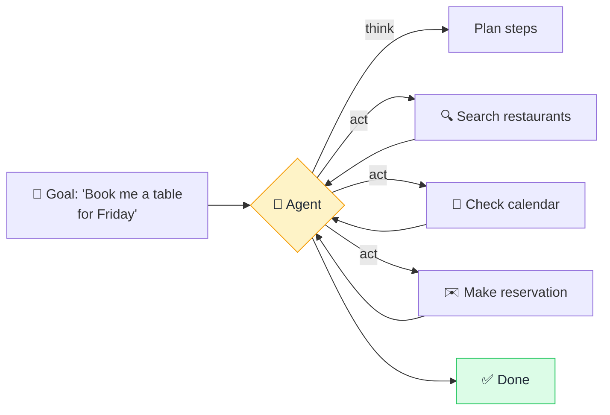

# 🤖 AI Agent

> **🧒 Explain Like I'm 5:** A regular AI just *talks*. An agent can *do* — it picks up tools, takes steps, and finishes a task for you.

## 🖼️ The Picture

## 🔧 How it actually works

An **AI agent** wraps an [LLM](llm.md) in a loop that lets it *act*, not just respond. Instead of one question → one answer, the agent works toward a goal: it **thinks** (what should I do next?), **acts** (uses a tool — search the web, run code, call an API, edit a file), **observes** the result, and repeats until the task is done.

The key ingredient is **tools**. On its own, an LLM can only produce text. Give it tools and let it decide when to use them, and suddenly it can look things up, do math reliably, send emails, or control software. The model generates a request like "search for X," the system runs it for real, and the result is fed back so the agent can continue reasoning.

Agents are powerful but trickier than plain chat: they can take wrong steps, get stuck in loops, or act on a [hallucination](hallucination.md). That's why good agents have guardrails, step limits, and often a human checkpoint before anything important or irreversible happens.

## 🌍 Real-world example

Claude Code (which writes and runs code in your terminal), AI assistants that browse the web to research and then act, and "computer use" tools that click around apps for you — all agents. They don't just suggest; they execute.

## 🔗 Related

- [LLM](llm.md)
- [Chain of Thought](chain-of-thought.md)
- [Hallucination](hallucination.md)
- [RAG](rag.md)
