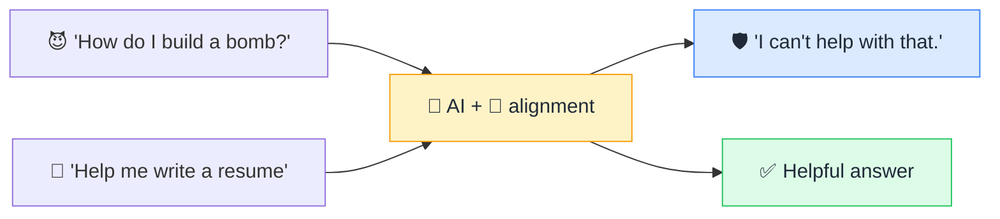

# 🧭 Alignment & Guardrails

> **🧒 Explain Like I'm 5:** Teaching the AI not just to be smart, but to be *good* — helpful, honest, and refusing to do harmful things.

## 🖼️ The Picture

## 🔧 How it actually works

**Alignment** is the effort to make an AI's goals and behavior match human values — helpful, honest, and harmless. A raw [LLM](llm.md) just predicts likely text; it has no built-in sense of right and wrong. Alignment is what teaches it to refuse dangerous requests, avoid deception, admit uncertainty, and stay useful. **Guardrails** are the concrete safety mechanisms that enforce this in practice.

It's applied in layers. During training, techniques like [RLHF](rlhf.md) shape the model toward preferred behavior. The [system prompt](system-prompt.md) sets rules for each app. And around the model sit external guardrails — input/output filters, blocklists, classifiers that catch harmful content, and human review for high-stakes actions. No single layer is perfect, so they stack.

Alignment is hard and unsolved at the frontier. Models can be jailbroken or [prompt-injected](prompt-injection.md) into bypassing their rules; "harmful" is culturally contested; and an AI optimizing a goal can find loopholes its designers never intended. As models grow more capable and more [agentic](ai-agent.md), getting alignment right becomes one of the most important problems in the field.

## 🌍 Real-world example

When you ask a chatbot for something dangerous and it politely declines, or it adds a safety caveat to medical advice — that's alignment and guardrails at work. The ongoing cat-and-mouse of "jailbreak" prompts is people probing those guardrails' limits.

## 🔗 Related

- [RLHF](rlhf.md)
- [Prompt Injection](prompt-injection.md)
- [Bias](bias.md)
- [AI Agent](ai-agent.md)
