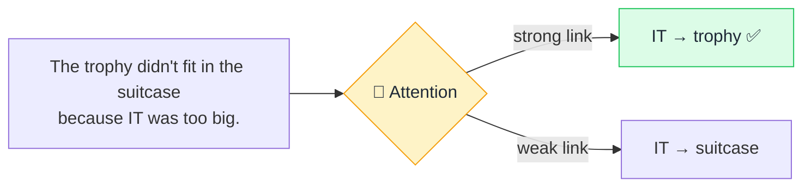

# 👀 Attention

> **🧒 Explain Like I'm 5:** Before answering, the AI highlights the words that matter most — like underlining the important parts of a sentence.

## 🖼️ The Picture

The model decides "it" refers to the *trophy*, by paying more attention to the right word.

## 🔧 How it actually works

**Attention** is the mechanism that lets a model weigh how much each word should influence each other word. For every word, it asks: "to understand *this*, which other words should I focus on, and how strongly?" Those focus strengths are called *attention weights*. Words that matter get high weights; irrelevant ones get low ones.

Concretely, each word produces three things: a **query** (what am I looking for?), a **key** (what do I offer?), and a **value** (my actual content). The model matches queries against keys to score relevance, then blends the values according to those scores. This is how "it," "this," or "the company" gets correctly tied to whatever they refer to.

Modern models use **multi-head attention** — running many attention checks in parallel, each learning a different kind of relationship (grammar, topic, references). It's the core trick inside the [Transformer](transformer.md), and the reason AI can keep track of meaning across long, complicated text.

## 🌍 Real-world example

When you ask an AI to summarize a long email and it correctly knows that "the deadline" mentioned at the end refers to "the Q3 report" mentioned at the start — that's attention linking them across the whole message.

## 🔗 Related

- [Transformer](transformer.md)
- [LLM](llm.md)
- [Context Window](context-window.md)
