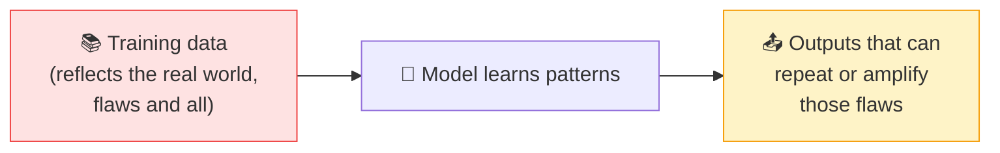

# ⚖️ Bias

> **🧒 Explain Like I'm 5:** AI learns from examples we give it. If those examples are unfair or one-sided, the AI quietly learns to be unfair too.

## 🖼️ The Picture

## 🔧 How it actually works

**Bias** is when an AI system produces systematically unfair or skewed results. It usually doesn't come from the algorithm having opinions — it comes from the **data**. A model learns patterns from whatever examples it's trained on, and if that data over-represents some groups, under-represents others, or reflects historical prejudice, the model absorbs those patterns as if they were "normal."

It can creep in at several points: **the data** (who/what is included or missing), **the labels** (human judgments baked into the training answers), and **how the model is used** (a tool tuned for one population applied to another). Because the patterns are statistical and invisible, biased behavior can look "objective" while quietly disadvantaging people.

Bias matters most when AI makes or influences decisions — hiring, lending, healthcare, policing. Mitigating it is an active effort, not an automatic fix: auditing data and outputs for fairness, testing across different groups, diversifying training data, and keeping humans in the loop for high-stakes calls. The first step is simply knowing it's there — AI is not neutral by default.

## 🌍 Real-world example

Resume-screening tools have downgraded female applicants because they were trained on a past dominated by male hires; image generators have defaulted to stereotypes for certain professions. Same lesson each time: the AI mirrored the data's bias right back at us.

## 🔗 Related

- [Training vs Inference](training-vs-inference.md)
- [Hallucination](hallucination.md)
- [Neural Network](neural-network.md)
