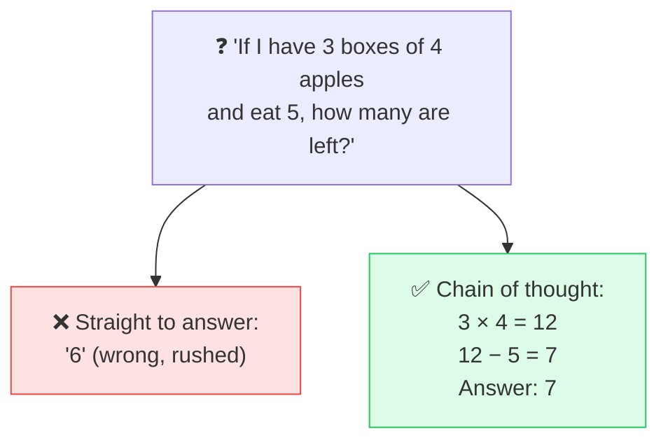

# 🔗 Chain of Thought

> **🧒 Explain Like I'm 5:** Instead of blurting out an answer, the AI "shows its work" step by step — and just like in math class, it gets more right that way.

## 🖼️ The Picture

## 🔧 How it actually works

**Chain of thought** (CoT) is when an [LLM](llm.md) works through a problem in intermediate steps before giving the final answer, instead of jumping straight to a conclusion. Because the model generates one [token](token.md) at a time, writing out the reasoning gives it a kind of "scratch space" — each step it produces becomes context that helps it produce the next step correctly.

The simplest way to trigger it is in the [prompt](prompt.md): add "let's think step by step" or "show your reasoning." This reliably improves performance on math, logic, and multi-step questions, because the model is no longer forced to compress a whole chain of reasoning into a single leap. Errors that would slip past in a quick answer get caught mid-thought.

Newer "reasoning models" do this internally and automatically — they spend extra compute thinking before they answer. The trade-off is cost and speed: more reasoning means more tokens and more time. For simple questions it's overkill; for hard ones it's the difference between a confident wrong answer and a correct one.

## 🌍 Real-world example

When you ask a modern AI a tricky word problem and it walks through the logic before answering — or when a "reasoning" model visibly "thinks" for a few seconds first — that's chain of thought making the answer more trustworthy.

## 🔗 Related

- [Prompt](prompt.md)
- [LLM](llm.md)
- [AI Agent](ai-agent.md)
