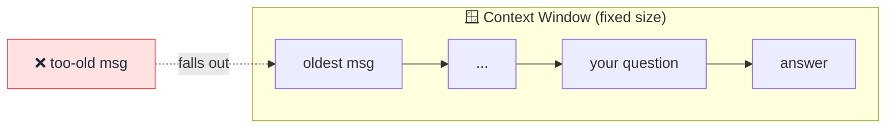

# 🪟 Context Window

> **🧒 Explain Like I'm 5:** It's the AI's short-term memory — how much it can hold in its head at once. Go past it, and the earliest stuff falls out.

## 🖼️ The Picture

Everything inside the window is "remembered." Anything pushed out is forgotten.

## 🔧 How it actually works

The **context window** is the maximum amount of text an [LLM](llm.md) can consider at one time, measured in [tokens](token.md). It includes *everything*: the system prompt, your earlier messages, the documents you pasted, and the answer being written. It's a hard ceiling — like the size of a desk you can only fit so many papers on.

When a conversation grows past the window, the oldest content gets dropped or summarized, which is why a long chat can seem to "forget" what you said at the start. The model isn't being forgetful on purpose — that text literally isn't in front of it anymore.

Window sizes have grown fast: early models held a few thousand tokens; modern ones hold hundreds of thousands or even millions (enough for whole books). Bigger windows let the AI reason over more material at once, but they cost more and can dilute focus — so it's still smart to give the model only what it needs.

## 🌍 Real-world example

If you paste a 50-page contract and ask questions, the AI can answer well *as long as the document fits in its context window.* Paste two 50-page contracts into a small window and it may lose track of the first one.

## 🔗 Related

- [Token](token.md)
- [Prompt](prompt.md)
- [RAG](rag.md)
