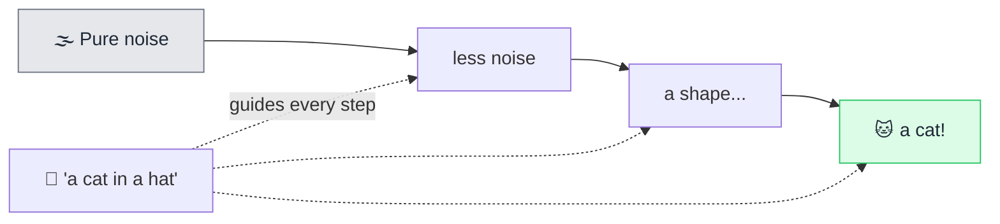

# 🎨 Diffusion Model

> **🧒 Explain Like I'm 5:** It starts with TV static and slowly cleans it up — step by step — until a real picture appears, like a statue emerging from marble.

## 🖼️ The Picture

## 🔧 How it actually works

A **diffusion model** generates images by learning to *remove noise*. During training it takes real images, gradually adds random noise until they're pure static, and learns to reverse each step. Once trained, you can hand it nothing but noise and it will "denoise" it into a brand-new, realistic image that never existed before.

To make it follow your words, the text prompt is turned into an [embedding](embedding.md) that **guides** every denoising step — nudging the emerging image toward "cat," "hat," "watercolor style," and so on. The model isn't copy-pasting from training images; it's sculpting fresh pixels that match the description, which is why you get original results.

This denoising happens over many small steps (often 20–50). More steps usually mean higher quality but slower generation. The same core idea now powers video, audio, and 3D generation too — it's one of the dominant techniques for AI that *creates* media rather than text.

## 🌍 Real-world example

Midjourney, DALL·E, and Stable Diffusion turn text prompts into images this way. The AI-generated art you've seen online — that wizard-cat, that fake product photo — was very likely sculpted out of noise by a diffusion model.

## 🔗 Related

- [Embedding](embedding.md)
- [Neural Network](neural-network.md)
- [Training vs Inference](training-vs-inference.md)
