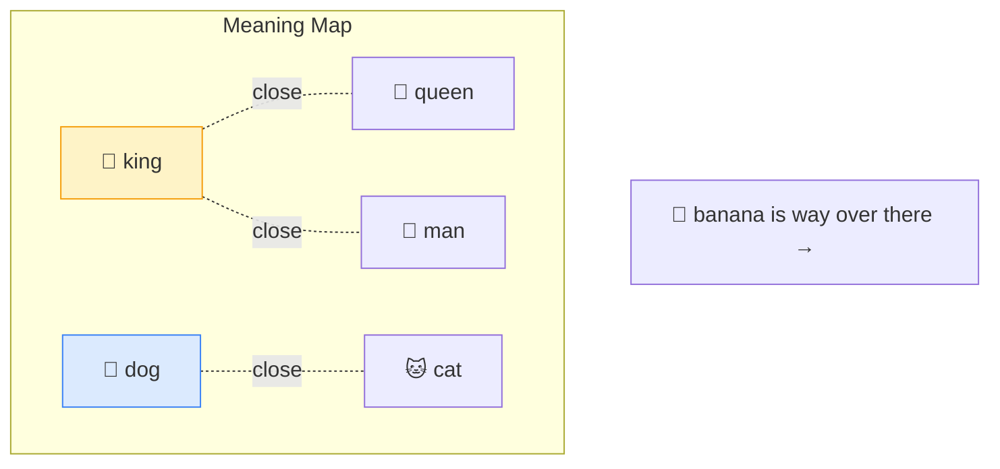

# 📍 Embedding

> **🧒 Explain Like I'm 5:** It's giving every word an address on a giant "meaning map," so things that mean similar stuff live close together.

## 🖼️ The Picture

"king" and "queen" sit near each other. "banana" is far away. Distance = difference in meaning.

## 🔧 How it actually works

An **embedding** turns a piece of text into a list of numbers (a *vector*) — often hundreds or thousands of them. You can think of each number as a coordinate, so the text becomes a single point in a very high-dimensional space. The magic: the model arranges this space so that **similar meanings end up near each other.**

Because meaning is now just geometry, the computer can *measure* it. "How related are these two sentences?" becomes "how far apart are their points?" This is what powers semantic search — finding results by meaning, not just matching keywords.

A famous party trick shows embeddings capture relationships: `king − man + woman ≈ queen`. The directions in the space actually carry meaning, like "royalty" or "gender." Same idea works for whole sentences, images, and audio.

## 🌍 Real-world example

When Spotify recommends a song that "feels like" what you're listening to, or when a search bar understands that "how to fix a flat tire" and "repairing a punctured wheel" mean the same thing — that's embeddings at work. They're also the backbone of [RAG](rag.md).

## 🔗 Related

- [Token](token.md)
- [RAG](rag.md)
- [Neural Network](neural-network.md)
