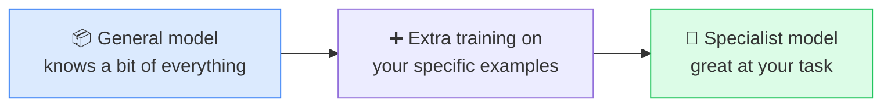

# 🎯 Fine-tuning

> **🧒 Explain Like I'm 5:** Take a smart generalist and give it extra lessons so it becomes an expert at one specific job.

## 🖼️ The Picture

## 🔧 How it actually works

**Fine-tuning** starts with an already-trained [LLM](llm.md) and trains it a little more on a focused set of examples — your data, your style, your domain. Instead of learning language from scratch (which costs a fortune), you nudge an existing model's weights so it gets especially good at a narrow task. It's the difference between hiring a smart graduate and giving them on-the-job training.

You'd reach for it when you need a consistent **format or tone** (always reply like our brand), **specialized knowledge or jargon** (legal, medical, a niche product), or **a behavior** that prompting alone can't reliably produce. Because it actually changes the model's weights, the new skill becomes "baked in" rather than re-explained in every prompt.

Important contrast: fine-tuning teaches the model *new behavior/style*, while [RAG](rag.md) gives the model *new facts to look up at answer time*. They solve different problems and are often combined. If you mostly need fresh or private facts, RAG is usually cheaper and easier than fine-tuning.

## 🌍 Real-world example

A customer-support bot fine-tuned on a company's past tickets learns to answer in that company's voice and handle its specific products — far better than a generic model guessing.

## 🔗 Related

- [Training vs Inference](training-vs-inference.md)
- [RAG](rag.md)
- [LLM](llm.md)
