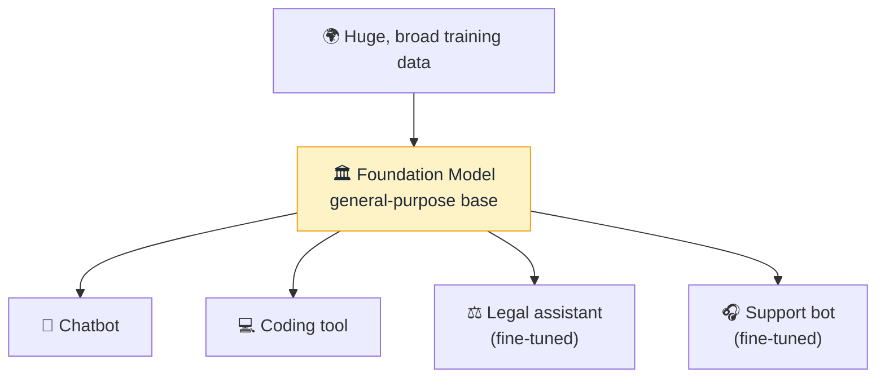

# 🏛️ Foundation Model

> **🧒 Explain Like I'm 5:** One giant, expensively-trained "base brain" that tons of different apps are built on top of — instead of everyone training their own from scratch.

## 🖼️ The Picture

## 🔧 How it actually works

A **foundation model** is a large model trained on broad, general data so it can be adapted to *many* downstream tasks. Rather than building a separate model for translation, another for summarizing, another for coding, you train one powerful general model — the foundation — and then specialize it as needed. [LLMs](llm.md) are the most famous example, but foundation models also exist for images, audio, and code.

The economics are the whole point. Training a foundation model is enormously expensive — huge datasets, thousands of [GPUs](gpu.md), weeks of compute. But once it exists, adapting it is cheap: you can [fine-tune](fine-tuning.md) it on a small specialized dataset, or just steer it with a good [prompt](prompt.md) and [RAG](rag.md). Thousands of products can stand on one foundation.

This "train once, reuse everywhere" pattern is why a handful of labs build the big base models and the rest of the industry builds *on* them. It's also why the term shows up in AI policy debates — a flaw or [bias](bias.md) in a widely-used foundation model propagates to everything built on top of it.

## 🌍 Real-world example

GPT, Claude, Llama, and Gemini are foundation models. The coding assistant, the customer-support bot, and the writing app you use are often all the *same* foundation model underneath, dressed up for different jobs.

## 🔗 Related

- [LLM](llm.md)
- [Fine-tuning](fine-tuning.md)
- [Training vs Inference](training-vs-inference.md)
