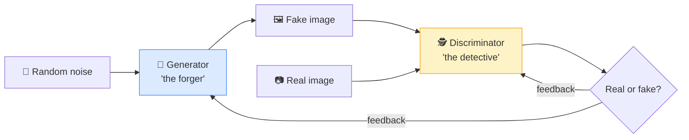

# 🎭 GAN (Generative Adversarial Network)

> **🧒 Explain Like I'm 5:** A forger and a detective in a duel. The forger makes fakes, the detective spots them, and they push each other until the fakes look totally real.

## 🖼️ The Picture

## 🔧 How it actually works

A **GAN** trains *two* [neural networks](neural-network.md) against each other. The **generator** tries to create fake data (say, a face) from random noise. The **discriminator** tries to tell the generator's fakes apart from real examples. They're rivals: every time the detective gets better at spotting fakes, the forger is forced to make more convincing ones, and vice versa.

This competition is the "adversarial" part, and it's a clever way to learn without anyone hand-labeling what "realistic" means. The generator never sees the real images directly — it only learns from whether it fooled the discriminator. At equilibrium, the fakes are so good the detective can do no better than a coin flip, and you can throw away the discriminator and keep the generator as your image-maker.

GANs dominated AI image generation in the late 2010s and are great at producing sharp, realistic results. They can be tricky to train (the two networks can destabilize each other), and for many tasks [diffusion models](diffusion-model.md) have since become the go-to — but GANs remain a foundational idea and power many [deepfake](#) and image-editing tools.

## 🌍 Real-world example

The eerily realistic faces at "thispersondoesnotexist.com" are GAN-generated — none of those people are real. GANs also power photo upscaling, style transfer, and many face-swapping apps.

## 🔗 Related

- [Diffusion Model](diffusion-model.md)
- [Neural Network](neural-network.md)
- [Training vs Inference](training-vs-inference.md)
