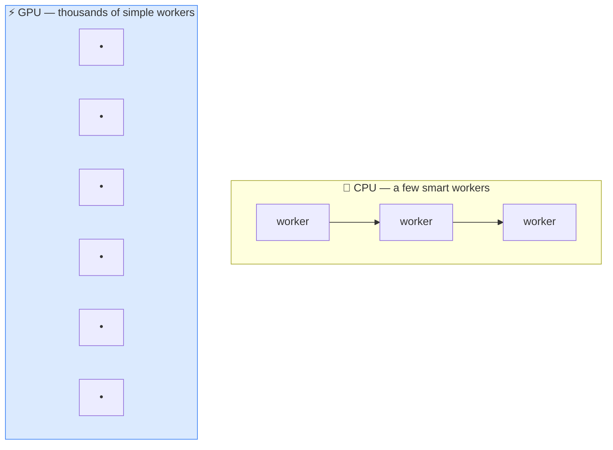

# ⚡ GPU (Graphics Processing Unit)

> **🧒 Explain Like I'm 5:** A normal chip has a few super-fast workers. A GPU has *thousands* of workers doing simple sums all at once — perfect for AI's mountain of math.

## 🖼️ The Picture

CPU = sequential and clever. GPU = massively parallel. AI math is huge but simple — so the GPU wins.

## 🔧 How it actually works

A **GPU** was originally built to draw video-game graphics, which means doing the *same* simple calculation on millions of pixels at the same time. It turns out that's exactly what [neural networks](neural-network.md) need: training and running a model is mostly enormous amounts of matrix multiplication — billions of small multiply-and-add operations that can all happen in parallel.

A regular **CPU** has a handful of powerful cores optimized for doing varied tasks one after another, very fast. A GPU has thousands of smaller cores that each do simple math, all at once. For AI's "do the same sum a billion times" workload, that parallelism makes a GPU tens to hundreds of times faster than a CPU.

This is why GPUs (and specialized AI chips like TPUs) are the engine of the AI boom — and why they're expensive and in huge demand. [Training](training-vs-inference.md) a large model can take thousands of GPUs running for weeks. [Quantization](quantization.md) and other tricks exist largely to squeeze big models onto fewer or smaller GPUs.

## 🌍 Real-world example

NVIDIA became one of the world's most valuable companies because nearly every AI lab buys its GPUs to train models. The same kind of chip in a gaming PC is, at heart, what powers ChatGPT behind the scenes.

## 🔗 Related

- [Neural Network](neural-network.md)
- [Training vs Inference](training-vs-inference.md)
- [Parameters / Weights](parameters-weights.md)
