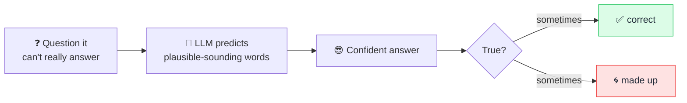

# 🌀 Hallucination

> **🧒 Explain Like I'm 5:** Sometimes the AI doesn't know the answer, but instead of saying "I don't know," it makes something up — and says it with total confidence.

## 🖼️ The Picture

## 🔧 How it actually works

A **hallucination** is when an [LLM](llm.md) produces something that sounds right but isn't — a fake citation, a wrong date, an invented function name. It happens because the model's core job is to generate *plausible* text, not *true* text. It predicts the next likely [token](token.md); it has no built-in fact-checker telling it when it's wrong.

The model also has no real sense of "I don't know." Saying nothing is rarely the most probable continuation, so it tends to fill the gap with a confident, fluent guess. The danger isn't that it's wrong — it's that it's wrong **convincingly**, which makes errors easy to miss.

You can reduce hallucinations but not fully eliminate them. Helpful tactics: ground the model in real sources with [RAG](rag.md), ask it to cite or quote, tell it that "I don't know" is an acceptable answer, and **always verify** anything important — names, numbers, quotes, legal/medical/financial claims.

## 🌍 Real-world example

Lawyers have been fined for submitting court filings with case citations an AI invented — they looked perfectly formatted and completely real, but the cases didn't exist. The lesson: trust, but verify.

## 🔗 Related

- [LLM](llm.md)
- [RAG](rag.md)
- [Prompt](prompt.md)
