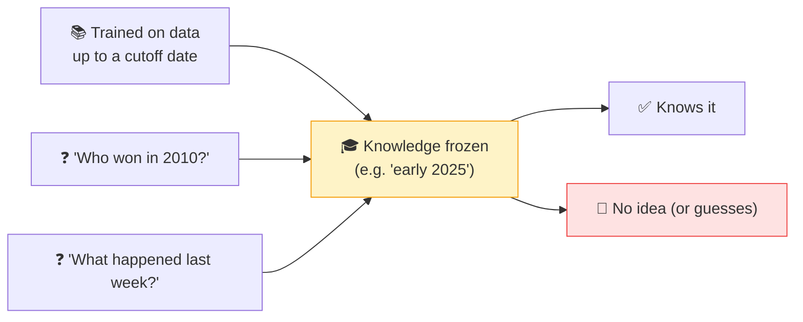

# 📅 Knowledge Cutoff

> **🧒 Explain Like I'm 5:** The AI "graduated" on a certain date and hasn't read anything since — so it doesn't know what happened after its last day of school.

## 🖼️ The Picture

## 🔧 How it actually works

An [LLM](llm.md) learns everything it knows during [training](training-vs-inference.md), from a snapshot of data collected up to a certain point in time. That point is the **knowledge cutoff**. After training, the model's knowledge is *frozen* — running it ([inference](training-vs-inference.md)) doesn't teach it anything new. So it simply has no information about events after its cutoff.

This causes a classic beginner surprise: ask about something very recent and the AI either says it doesn't know, or worse, confidently [hallucinates](hallucination.md) an answer because "I don't know" isn't its natural instinct. It's not lying — it genuinely never saw that information. The model also can't know *your* private facts, for the same reason.

Two things get around the cutoff without retraining: [RAG](rag.md) (let the model look information up in a live source) and [tool calling](tool-calling.md) (let it search the web in real time). That's why AI assistants connected to search can answer about today's news while the base model alone cannot.

## 🌍 Real-world example

Ask a base chatbot "who won yesterday's game?" and it can't say — that's past its cutoff. Ask the *same* assistant with web access enabled, and it searches and tells you. Same model, but now it can reach beyond its frozen knowledge.

## 🔗 Related

- [Training vs Inference](training-vs-inference.md)
- [RAG](rag.md)
- [Hallucination](hallucination.md)
