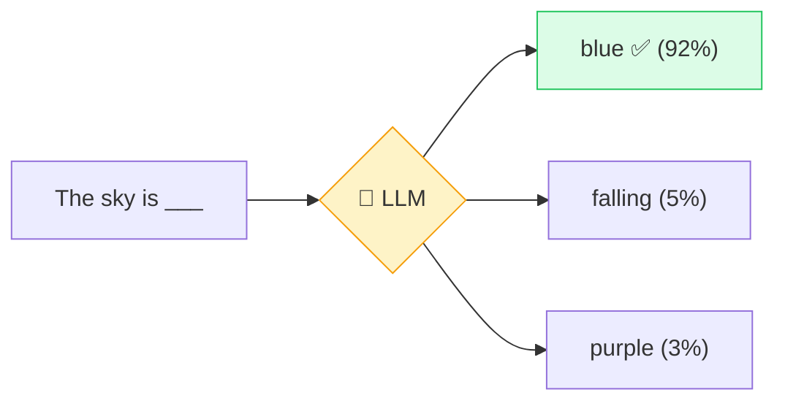

# 🗣️ LLM (Large Language Model)

> **🧒 Explain Like I'm 5:** It's a super-reader that read almost the whole internet, and now it's really, really good at guessing which word comes next.

## 🖼️ The Picture

It looks at the words so far, then predicts the most likely next chunk — over and over — until a full answer appears.

## 🔧 How it actually works

An LLM is a giant pattern-matching machine trained on enormous amounts of text — books, websites, code, conversations. During training it played one game billions of times: *"given this text, predict the next piece."* By getting better at that single game, it absorbed grammar, facts, reasoning patterns, and writing styles.

When you chat with it, it isn't looking up answers in a database. It's generating one [token](token.md) at a time, each time asking "what's the most plausible next chunk given everything so far?" Stack millions of those tiny predictions together and you get essays, code, and explanations.

"Large" is literal: these models have **billions of parameters** (the internal dials it tuned during training). More parameters and more data generally mean a model that captures subtler patterns — which is why modern LLMs feel surprisingly capable, even though under the hood it's still "predict the next bit."

## 🌍 Real-world example

ChatGPT, Claude, and Gemini are all LLMs. The same tech powers the autocomplete that finishes your sentences in Gmail and the coding suggestions in tools like GitHub Copilot.

## 🔗 Related

- [Token](token.md)
- [Neural Network](neural-network.md)
- [Training vs Inference](training-vs-inference.md)
- [Hallucination](hallucination.md)
