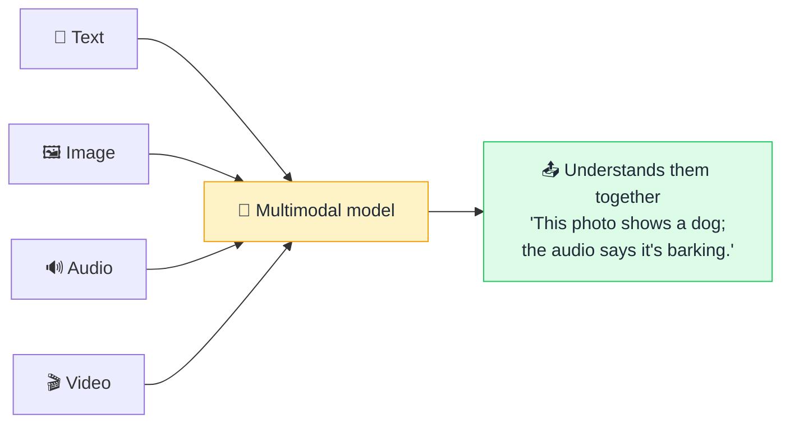

# 🌈 Multimodal

> **🧒 Explain Like I'm 5:** Most AIs only read words. A multimodal AI can also *see* pictures, *hear* sounds, and *watch* video — using more than one sense at once.

## 🖼️ The Picture

## 🔧 How it actually works

A *modality* is a type of data — text, images, audio, video. A **multimodal** model can take in (and sometimes produce) more than one of them. Instead of a separate tool for each, one model understands a photo *and* the question you asked about it, together.

The trick is turning every modality into the same "language" the model understands: [embeddings](embedding.md). An image gets encoded into vectors, audio into vectors, text into vectors — all living in a shared meaning-space. Once everything is in that common format, the model's [attention](attention.md) can relate a word to a region of an image or a moment in a clip, reasoning across them as one.

This unlocks things text-only AI can't do: describe a photo, read a chart, transcribe and answer questions about a meeting, or generate an image from a sentence. The most capable modern assistants are multimodal by default — you can paste a screenshot and just ask about it.

## 🌍 Real-world example

Pointing your phone camera at a foreign menu and asking an AI "what's vegetarian here?" — it reads the image, understands your text question, and answers. That's multimodal AI in one tap.

## 🔗 Related

- [Embedding](embedding.md)
- [Attention](attention.md)
- [LLM](llm.md)
