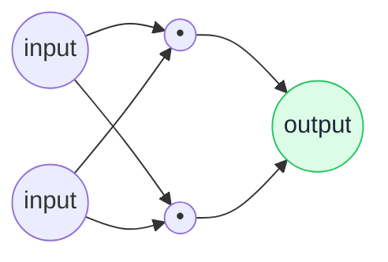

# 🕸️ Neural Network

> **🧒 Explain Like I'm 5:** It's a guessing machine made of tiny switches. When it guesses wrong, it nudges the switches a little, and slowly gets really good.

## 🖼️ The Picture

Inputs flow through layers of connected "neurons." Each connection has a weight (a dial). Learning = adjusting the dials.

## 🔧 How it actually works

A neural network is loosely inspired by the brain. It's made of **neurons** arranged in layers: an input layer, one or more hidden layers, and an output layer. Each connection between neurons has a **weight** — a number that says how much that signal matters. Data flows in, gets multiplied and combined by all those weights, and an answer pops out the other end.

Learning happens through **feedback**. The network makes a prediction, compares it to the correct answer, and measures how wrong it was (the "loss"). Then a process called **backpropagation** traces that error backward and slightly adjusts every weight to make the mistake smaller next time. Repeat this millions of times and the dials settle into values that produce good answers.

What makes this powerful is **depth**. Early layers learn simple features (edges, basic word patterns); later layers combine them into complex ideas (faces, grammar, meaning). "Deep learning" just means a neural network with many layers. An [LLM](llm.md) is one enormous neural network.

## 🌍 Real-world example

The system that recognizes your face to unlock your phone, filters spam out of your inbox, and lets your camera blur the background on video calls — all neural networks.

## 🔗 Related

- [LLM](llm.md)
- [Training vs Inference](training-vs-inference.md)
- [Embedding](embedding.md)
