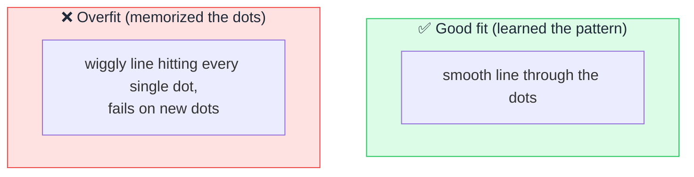

# 📏 Overfitting

> **🧒 Explain Like I'm 5:** It's when AI memorizes the exact answers from its practice test instead of actually learning the subject — so it aces practice but flunks the real exam.

## 🖼️ The Picture

## 🔧 How it actually works

**Overfitting** happens when a model learns its training data *too* well — including the random noise and quirks — instead of the general pattern underneath. It's like a student who memorizes that "question 3's answer is B" rather than understanding the material. On data it has seen, it looks brilliant; on new data, it stumbles.

The tell-tale sign is a big gap between **training performance** (great) and **test performance** (poor). The model has essentially built a lookup table of its examples rather than a flexible understanding. The opposite problem, **underfitting**, is when a model is too simple to capture the pattern at all — like answering every exam question with one rule.

Practitioners fight overfitting with **more and more varied data**, **regularization** (penalties that discourage the model from getting too complex), **dropout** (randomly ignoring parts of the network during training so it can't over-rely on any one path), and holding out a **validation set** to catch the problem early. The goal is *generalization* — performing well on data it has never seen.

## 🌍 Real-world example

A spam filter trained only on 2015 emails might "memorize" those exact spammy phrases and then miss modern scams entirely. It overfit to the old data instead of learning what spam generally looks like.

## 🔗 Related

- [Training vs Inference](training-vs-inference.md)
- [Neural Network](neural-network.md)
- [Bias](bias.md)
