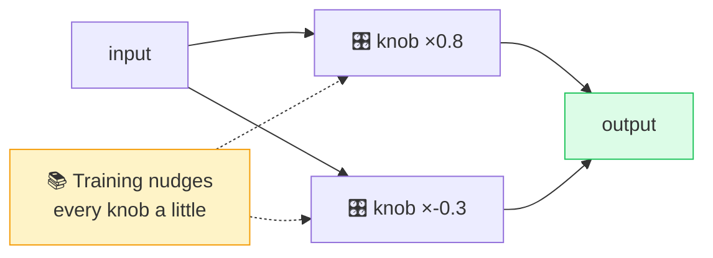

# 🎛️ Parameters / Weights

> **🧒 Explain Like I'm 5:** Imagine billions of tiny volume knobs inside the AI. "Learning" is just slowly turning each knob to the right spot.

## 🖼️ The Picture

## 🔧 How it actually works

**Parameters** (also called **weights**) are the numbers inside a [neural network](neural-network.md) that determine how it behaves. Each connection between neurons has a weight that says how strongly a signal passes through. Together, all these numbers *are* the model — its entire "knowledge" is stored as the specific values of its parameters.

[Training](training-vs-inference.md) is the process of finding good values for them. The model starts with random weights, makes predictions, sees how wrong it was, and nudges every weight slightly to do better next time. Repeat billions of times and the knobs settle into a configuration that produces useful outputs. Once training stops, the weights are frozen — that frozen file is what you download or call as "the model."

When you hear a model is "**7B**" or "**70B**," that's the parameter count — 7 billion or 70 billion weights. More parameters generally means more capacity to capture complex patterns, but also more memory, more [GPU](gpu.md) power, and more cost to run. That tension is exactly why [quantization](quantization.md) (shrinking the weights) exists.

## 🌍 Real-world example

When you see "Llama 3 8B" vs "Llama 3 70B," the number is the parameter count. The 70B version is smarter but needs far beefier hardware — same recipe, vastly more knobs.

## 🔗 Related

- [Neural Network](neural-network.md)
- [Training vs Inference](training-vs-inference.md)
- [Quantization](quantization.md)
