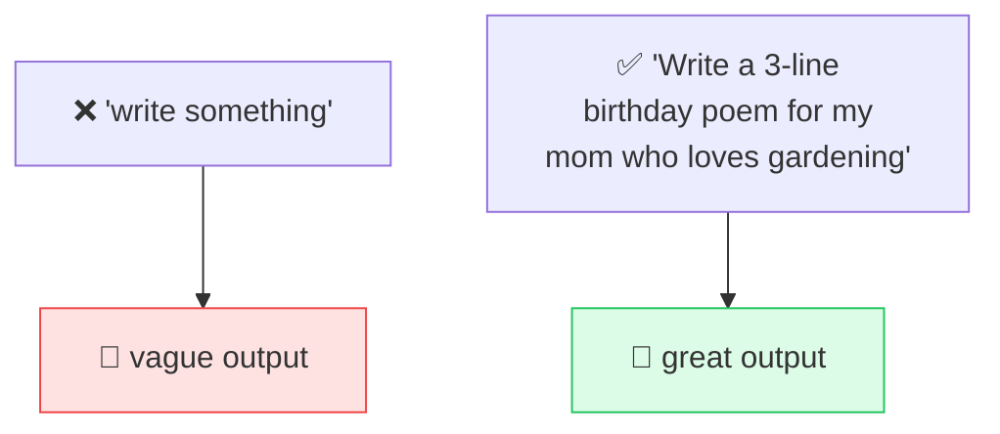

# 💬 Prompt

> **🧒 Explain Like I'm 5:** It's what you say to the AI. Ask a clear question, get a clear answer. Ask a fuzzy one, get a fuzzy one.

## 🖼️ The Picture

The quality of your input shapes the quality of the output.

## 🔧 How it actually works

A **prompt** is the text you give an [LLM](llm.md) to tell it what you want. Since the model works by predicting what comes next, your prompt sets the entire direction — it's the starting context that everything else is generated from. Better instructions in, better results out.

A few reliable ways to improve a prompt: **be specific** (audience, length, format, tone), **give an example** of what good looks like, **assign a role** ("You are a patient math tutor…"), and **break big asks into steps**. This craft is often called *prompt engineering*, but it's really just clear communication.

Many AI apps also use a hidden **system prompt** — background instructions set by the developer that you don't see — plus your visible message. Together they form the full input the model reads. Everything in the prompt competes for room in the [context window](context-window.md).

## 🌍 Real-world example

Asking ChatGPT "give me dinner ideas" gets generic suggestions. Asking "give me 3 quick vegetarian dinners I can make in 20 minutes with chickpeas, no nuts" gets something you'd actually cook. Same model — better prompt.

## 🔗 Related

- [LLM](llm.md)
- [Context Window](context-window.md)
- [Hallucination](hallucination.md)
