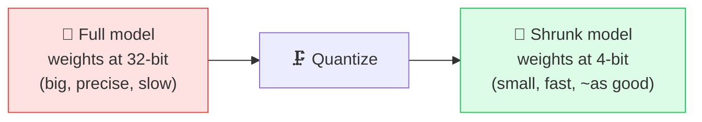

# 🗜️ Quantization

> **🧒 Explain Like I'm 5:** Like saving a photo as a smaller file — the model gets lighter and faster, and looks *almost* as good, so it can run on your laptop or phone.

## 🖼️ The Picture

## 🔧 How it actually works

A model's [parameters](parameters-weights.md) are normally stored as high-precision numbers (e.g. 32 or 16 bits each). **Quantization** rounds them to use fewer bits — often 8-bit or even 4-bit. Fewer bits per weight means the model takes up much less memory and runs faster, because there's simply less data to move and multiply.

The surprise is how little quality you lose. A model has so many weights that small rounding errors mostly wash out, so a well-quantized model often performs nearly as well as the full-precision original while using a *fraction* of the memory. A 70-billion-parameter model that needed multiple data-center [GPUs](gpu.md) at full precision might fit on a single consumer GPU once quantized.

This is the key technology behind **running AI locally** — on laptops, phones, and hobbyist setups — and behind cheaper, faster inference at scale. There's a trade-off dial: the more aggressively you quantize (32 → 16 → 8 → 4 bits), the smaller and faster it gets, but past a point quality starts to noticeably drop.

## 🌍 Real-world example

Tools like Ollama or llama.cpp let you run a capable chatbot offline on your own laptop — that's only possible because the model has been quantized down to a size your hardware can handle.

## 🔗 Related

- [Parameters / Weights](parameters-weights.md)
- [GPU](gpu.md)
- [Training vs Inference](training-vs-inference.md)
