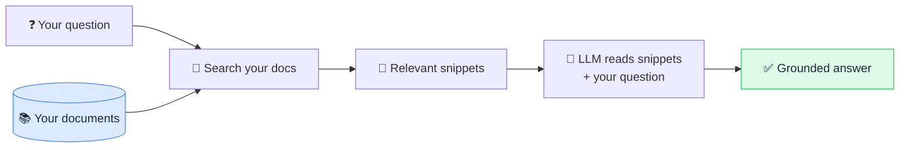

# 📖 RAG (Retrieval-Augmented Generation)

> **🧒 Explain Like I'm 5:** Before answering, the AI quickly looks things up in *your* books — so it stops guessing and starts citing.

## 🖼️ The Picture

## 🔧 How it actually works

**RAG** combines two steps: **retrieval** (find relevant information) and **generation** (write the answer). Instead of relying only on what the [LLM](llm.md) memorized during training, the system first searches a knowledge source — your documents, a database, the web — pulls out the most relevant pieces, and hands them to the model alongside your question.

The search step usually uses [embeddings](embedding.md): your documents are converted into vectors and stored in a *vector database*, and your question is matched to the closest chunks by meaning. Those chunks get stuffed into the [context window](context-window.md) so the model can read them right before answering — essentially giving it an open-book exam.

Why it matters: RAG lets AI use **fresh, private, or specialized** information it was never trained on, and it can **cite sources**, which makes answers verifiable and reduces [hallucination](hallucination.md). It's also easier and cheaper to update than [fine-tuning](fine-tuning.md) — just change the documents, no retraining needed.

## 🌍 Real-world example

A company chatbot that answers questions about *your* internal policies, or an AI search engine that links to the pages it used (like Perplexity), is doing RAG — looking it up, then writing it up.

## 🔗 Related

- [Embedding](embedding.md)
- [Context Window](context-window.md)
- [Fine-tuning](fine-tuning.md)
- [Hallucination](hallucination.md)
