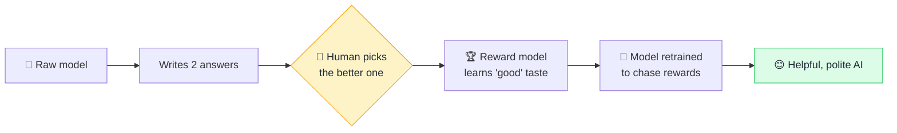

# 👍 RLHF (Reinforcement Learning from Human Feedback)

> **🧒 Explain Like I'm 5:** People give the AI thumbs-up or thumbs-down on its answers, and it learns to give more of the thumbs-up kind — like training a puppy with treats.

## 🖼️ The Picture

## 🔧 How it actually works

A freshly trained [LLM](llm.md) is knowledgeable but rude, rambly, and happy to help with harmful things — it just predicts likely text, with no sense of what's *helpful* or *appropriate*. **RLHF** is the polishing step that turns that raw model into a useful assistant by teaching it human preferences.

It works in stages. First, humans compare pairs of model answers and pick the better one, over and over. Those choices train a **reward model** — a separate AI that learns to score any answer the way humans would. Then the main model is fine-tuned using reinforcement learning: it generates responses, the reward model grades them, and the model adjusts to earn higher scores. In short, it learns to produce answers people actually like.

This is the secret sauce that made chatbots feel genuinely helpful rather than just clever. It's also how a lot of safety behavior gets installed — refusing dangerous requests, admitting uncertainty, staying on topic. The catch: it bakes in *whose* preferences did the rating, which is one more place [bias](bias.md) can sneak in.

## 🌍 Real-world example

The jump from raw GPT to ChatGPT was largely RLHF. Every time you click 👍 or 👎 on an AI response, you're often feeding the exact kind of signal these systems learn from.

## 🔗 Related

- [Training vs Inference](training-vs-inference.md)
- [Fine-tuning](fine-tuning.md)
- [Bias](bias.md)
