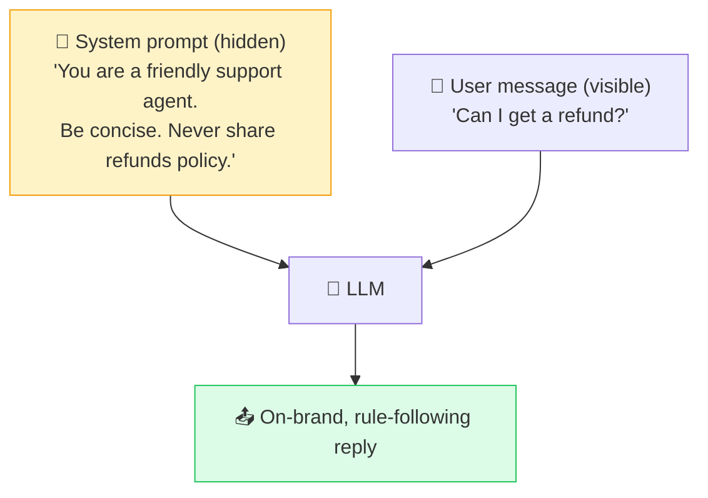

# 🪪 System Prompt

> **🧒 Explain Like I'm 5:** It's the AI's secret job description — instructions it reads before every chat that tell it who to be and how to behave.

## 🖼️ The Picture

## 🔧 How it actually works

A **system prompt** is a special set of instructions placed at the very start of the conversation, *before* anything you type. It sets the AI's role, tone, rules, and boundaries — "you are a patient tutor," "always answer in JSON," "never give medical advice." You usually don't see it; the app developer writes it.

To the model, the system prompt is just more text in its [context window](context-window.md), but it's positioned and weighted to act as standing orders that shape every response. Your messages are then interpreted *through* that lens. It's the difference between the same [LLM](llm.md) acting as a cheerful barista bot or a terse legal assistant — same brain, different job description.

Because it's so influential, the system prompt is also a key safety and product-design tool: it's where guardrails, persona, and capabilities are defined. But it isn't bulletproof — cleverly crafted user input can sometimes override it, which is the whole danger of [prompt injection](prompt-injection.md).

## 🌍 Real-world example

When a company's website chatbot stays perfectly on-brand, refuses to discuss competitors, and always signs off the same way — that consistency is its system prompt quietly steering every reply.

## 🔗 Related

- [Prompt](prompt.md)
- [Context Window](context-window.md)
- [Prompt Injection](prompt-injection.md)
