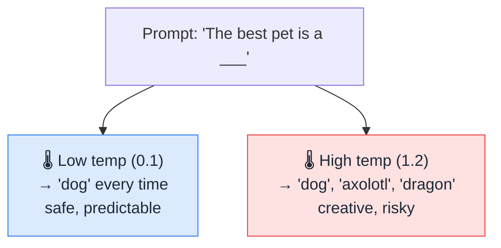

# 🌡️ Temperature

> **🧒 Explain Like I'm 5:** It's the AI's creativity dial. Turn it down and it plays it safe; turn it up and it gets wild and surprising.

## 🖼️ The Picture

## 🔧 How it actually works

At each step, an [LLM](llm.md) doesn't pick one next [token](token.md) with certainty — it produces a *probability* for every possible next token ("dog" 60%, "cat" 25%, "axolotl" 1%…). **Temperature** controls how sharply it favors the most likely options when choosing.

**Low temperature** (near 0) makes the model almost always pick the top choice — output becomes focused, consistent, and repeatable. Great for facts, code, and anything where you want the "correct" answer. **High temperature** flattens the odds so less-likely words get a real chance — output becomes more varied, creative, and surprising, but also more error-prone and rambly.

There's no universally "right" setting — it depends on the job. Need a reliable JSON response or a math answer? Turn it down. Brainstorming names, writing poetry, or want fresh ideas? Turn it up. Many tools default to a middle value (~0.7) as a balance. (Related dials you'll sometimes see: *top-p* and *top-k*, which limit the pool of candidates differently.)

## 🌍 Real-world example

An AI coding assistant runs at low temperature so it gives you the same correct function every time. An AI story-writing app runs hotter so each generated tale feels different and imaginative.

## 🔗 Related

- [LLM](llm.md)
- [Token](token.md)
- [Prompt](prompt.md)
