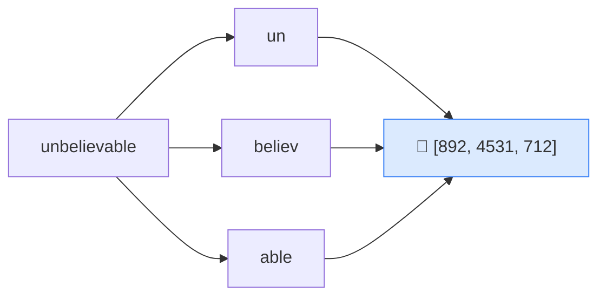

# 🔤 Token

> **🧒 Explain Like I'm 5:** AI doesn't read whole words — it reads little puzzle pieces called tokens, and snaps them together.

## 🖼️ The Picture

A word can be one token, or several. Each token becomes a number the model can do math on.

## 🔧 How it actually works

Computers can't do math on letters, so text is first chopped into **tokens** — common chunks of characters — and each token is mapped to a number (an ID). A token is often a whole word ("cat"), but longer or rarer words get split ("tokenization" → "token" + "ization"). Spaces and punctuation count too.

A rough rule of thumb for English: **1 token ≈ 4 characters ≈ ¾ of a word.** So 100 tokens is about 75 words. This is why you'll sometimes see AI tools talk about "token limits" instead of word limits.

Tokens matter for two practical reasons: **cost** (most AI APIs charge per token, in *and* out) and **capacity** (the [context window](context-window.md) is measured in tokens). Fewer, well-chosen words = fewer tokens = cheaper and more room to work.

## 🌍 Real-world example

When an AI API bill says "you used 1,500 tokens," that's counting both your question and the answer in these little chunks. The emoji 😀 you sent? That might be 2–3 tokens all by itself.

## 🔗 Related

- [LLM](llm.md)
- [Context Window](context-window.md)
- [Embedding](embedding.md)
