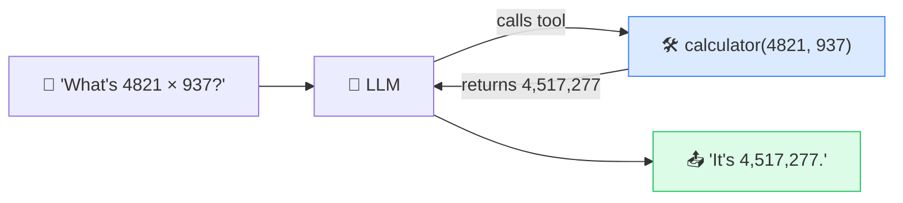

# 🛠️ Tool Calling (Function Calling)

> **🧒 Explain Like I'm 5:** On its own, the AI can only talk. Tool calling lets it pick up a calculator, look at a calendar, or press buttons in an app — so it can actually get things done.

## 🖼️ The Picture

## 🔧 How it actually works

An [LLM](llm.md) by itself can only generate text — it can't truly do math, check today's weather, or send an email. **Tool calling** bridges that gap. The developer describes some tools (a calculator, a search function, a database query) and their inputs. When the model decides a tool would help, instead of guessing, it outputs a structured request like `get_weather(city="Paris")`.

The surrounding system actually *runs* that function, gets the real result, and feeds it back to the model. The model then continues, now armed with a true fact instead of a [hallucinated](hallucination.md) one. From the user's side it feels seamless — you asked a question, you got an accurate answer — but under the hood the AI reached out to real code.

This is the foundation that turns a chatbot into an [AI agent](ai-agent.md). Give a model a rich enough toolbox — web search, code execution, app controls — and it can chain tools together to complete real tasks. Standards like **MCP (Model Context Protocol)** exist to make connecting these tools easy and reusable across different AIs.

## 🌍 Real-world example

When ChatGPT browses the web for current info, runs Python to crunch numbers, or an assistant adds an event straight to your calendar — that's tool calling. The AI isn't pretending to know; it's using a real tool and reporting back.

## 🔗 Related

- [AI Agent](ai-agent.md)
- [LLM](llm.md)
- [Hallucination](hallucination.md)
