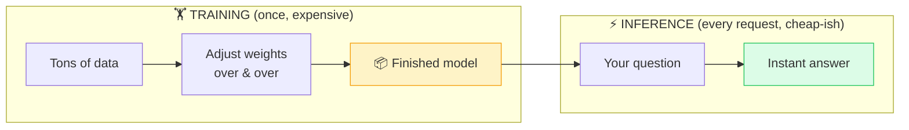

# 🏋️ Training vs Inference

> **🧒 Explain Like I'm 5:** Training is studying for the test (slow, hard, happens once). Inference is taking the test (fast, happens every time you ask a question).

## 🖼️ The Picture

## 🔧 How it actually works

**Training** is how a model *learns*. You feed it mountains of data and let it adjust its internal weights again and again (see [Neural Network](neural-network.md)). This is the heavy, expensive part — it can take weeks on thousands of specialized chips and cost millions of dollars for a large [LLM](llm.md). The output is a finished set of weights: the "model."

**Inference** is using the trained model to get an answer. The weights are now frozen — the model isn't learning anymore, it's just applying what it already knows. This is what happens every single time you send a prompt. It's far cheaper and faster than training, usually finishing in seconds (or milliseconds).

The key mental model: **training happens rarely, inference happens constantly.** A model might be trained once and then run inference billions of times for millions of users. That's also why a model doesn't "remember" your last conversation by default — inference doesn't change its weights. (Learning *new* skills later is [fine-tuning](fine-tuning.md).)

## 🌍 Real-world example

When a company "releases a new model," they finished an expensive training run. When you type a message and get a reply a second later, that's inference — the same frozen model answering you and a million other people at once.

## 🔗 Related

- [Neural Network](neural-network.md)
- [Fine-tuning](fine-tuning.md)
- [LLM](llm.md)
