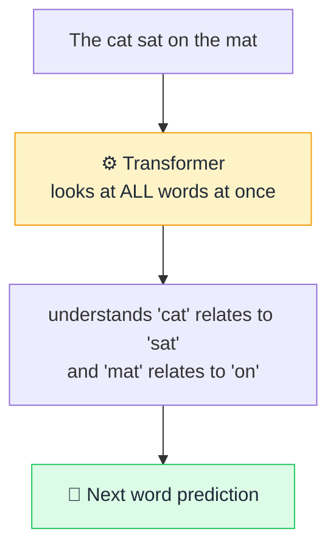

# ⚙️ Transformer

> **🧒 Explain Like I'm 5:** It's the engine inside modern AI that reads *every* word in a sentence at the same time, instead of one-by-one — so it never loses the plot.

## 🖼️ The Picture

## 🔧 How it actually works

The **Transformer** is the architecture (the blueprint) behind almost every modern [LLM](llm.md) — the "T" in GPT literally stands for it. Before Transformers, AI read text one word at a time, like reading through a straw, and tended to forget the beginning of long sentences. The Transformer's big idea: process the *whole* sequence in parallel and let every word directly "look at" every other word.

The mechanism that makes this work is [attention](attention.md) — for each word, the model figures out which other words matter most to its meaning. "It" in a sentence can instantly connect back to the noun it refers to, even if that noun was 50 words ago. Stack many of these attention layers together and the model builds a rich understanding of how everything relates.

Two practical superpowers come from this design: it's **parallelizable** (you can train it on huge data fast using modern chips), and it handles **long-range context** well. That combination is exactly why AI suddenly got so good after the Transformer was introduced in 2017.

## 🌍 Real-world example

Every time you use ChatGPT, Claude, Google Translate, or GitHub Copilot, you're using a Transformer. It's the single architecture behind the entire current AI boom.

## 🔗 Related

- [Attention](attention.md)
- [LLM](llm.md)
- [Neural Network](neural-network.md)
