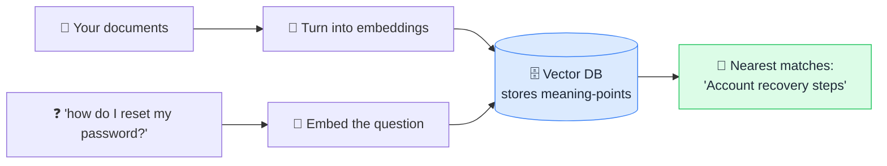

# 🗄️ Vector Database

> **🧒 Explain Like I'm 5:** A special library that files things by *meaning* instead of by title — so "find me something similar" actually works.

## 🖼️ The Picture

## 🔧 How it actually works

A **vector database** is built to store and search [embeddings](embedding.md) — those lists of numbers that represent meaning as coordinates. A normal database is great at exact matches ("find the row where id = 42"). A vector database is great at *fuzzy* matches: "find the items whose meaning is closest to this."

When you add data, each chunk is converted into a vector and stored. When you query, your question is also converted into a vector, and the database finds the **nearest neighbors** — the points closest in the meaning-space. To stay fast across millions of items, it uses clever indexing (approximate nearest-neighbor search) so it doesn't have to compare against every single entry.

This is the storage engine that makes [RAG](rag.md) practical. Instead of stuffing every document into the [context window](context-window.md), you keep everything in a vector database and pull only the handful of most-relevant pieces at answer time.

## 🌍 Real-world example

"Customers who liked this also liked…" recommendations, semantic search bars that understand intent, and company chatbots that answer from internal docs all sit on a vector database. Popular ones include Pinecone, Weaviate, Chroma, and pgvector.

## 🔗 Related

- [Embedding](embedding.md)
- [RAG](rag.md)
- [Context Window](context-window.md)
